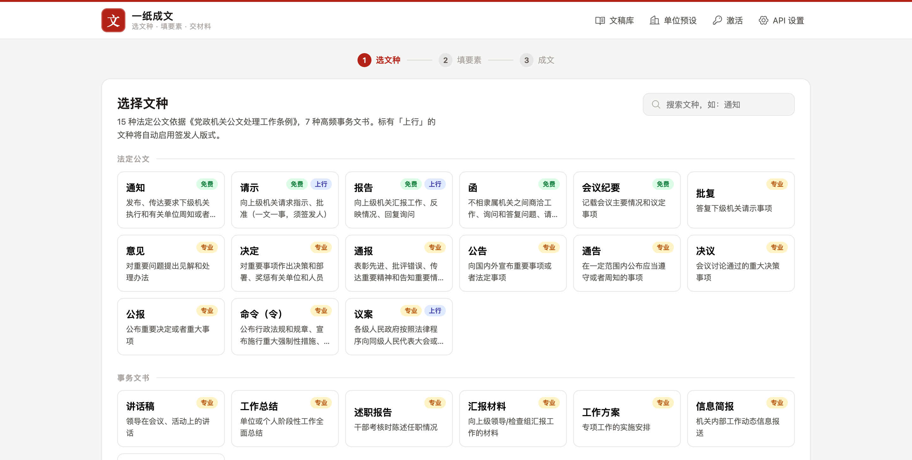

# 一纸成文（YiZhi ChengWen）

> **选文种 · 填要素 · 交材料。** AI 拟稿 + GB/T 9704-2012 国标排版，10 秒生成可直接使用的标准公文 Word 文档。
> 纯前端 · 免安装 · 零服务器成本 · 买断制商业产品。

<!-- 线上地址部署后填写：https://hankguo.github.io/yizhi-chengwen/ -->



## 产品能力

| 能力 | 说明 |
|---|---|
| 22 种文种 | 15 种法定公文（依据《党政机关公文处理工作条例》）+ 7 种高频事务文书，每种带标准框架与专属提示词 |
| AI 拟稿（BYOK） | 接任意 OpenAI 兼容接口（DeepSeek/通义/Kimi/智谱/OpenAI），流式输出，一篇材料成本约 1 分钱；强制【　】占位纪律，不编造数字 |
| 国标排版引擎 | 红头、发文字号、二号小标宋标题、三号仿宋正文、29 磅固定行距、上行文签发人版式、单双页码外侧、版记三线，全部按 GB/T 9704-2012 写入 docx |
| 格式自查 | 层级跳级、规范结束语缺失、日期格式、AI 腔、Markdown 残留、附件遗漏等 10 类规则自动检查 |
| 单位预设 | 保存单位红头/落款/抄送，写文一键套用 |
| 文稿库 | 本地保存历史文稿（localStorage），随时回填修改 |
| 近似分页预览 | 按 22 行/页模拟 A4 分页 + 页数估算 + 缩放 + 打印/导出 PDF |
| 离线激活 | Ed25519 签名激活码，买断制，无账号无服务器 |

## 本地运行

```bash
cd app && python3 -m http.server 8080
# 打开 http://localhost:8080
```

无构建、无依赖安装。部署到任意免费静态托管（GitHub Pages / Cloudflare Pages）即可上线。

## 测试

```bash
bash tests/run.sh
# 37 项断言：Parser / Checker / License 验签与防篡改 / 22 文种 docx 国标 XML 断言 / 分页预览
```

## 目录结构

```
├── app/                    # 产品本体（纯静态，可直接部署）
│   ├── index.html          # 单页应用
│   ├── style.css           # 设计系统（公文红单强调色）
│   ├── js/
│   │   ├── wenzhong.js     # 22 文种库 + 框架库 + 专属 AI 提示词（内容资产）
│   │   ├── samples.js      # 各文种示例
│   │   ├── parser.js       # 正文层级解析
│   │   ├── format.js       # ★ GB/T 9704-2012 排版引擎（docx 构建 + 分页预览）
│   │   ├── checker.js      # 格式与文风自查
│   │   ├── store.js        # 单位预设 + 文稿库（本地）
│   │   ├── ai.js           # BYOK 流式 AI 客户端
│   │   ├── license.js      # Ed25519 离线激活验证
│   │   └── app.js          # 主控制器
│   └── vendor/             # docx.js 9.5.1 / tweetnacl 1.0.3 / Phosphor 图标（本地化，无 CDN 依赖）
├── skill/gongwen-chengwen/ # 免费开源的公文 Skill（Claude Code / Codex 可用，MIT）
├── tests/                  # 自动化测试（bash tests/run.sh）
└── docs/screenshots/       # 产品截图
```

商业计划文档、激活码签发工具与私钥未随本仓库发布。

## 免责声明

本工具仅供写作参考与格式排版辅助，不提供代写服务；正式公文须经本单位核稿签发后使用。AI 生成内容请务必人工核实。

Copyright (c) 2026 HankGuo. 保留所有权利（`skill/` 目录除外，见其内说明）。
